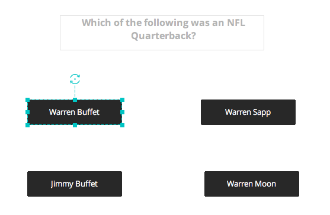
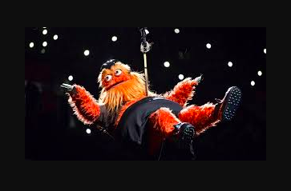

# Who Wants to Be a Millionaire: Sports Fan Edition

* Game will start after user clicks the "Start" button on the first page. 

* From there, the user will see 1-15, each with a dollar amount assigned to it, increasing from $500 at level one, to $1,000,000 at level 15.

* At the beginning of the game, the user will see all 15 levels displayed with their corresponding dollar amount awarded for answering the question correctly. As the user progresses through the game, they will see the next level with the corresponding dollar amount for that question only, not all 15 levels. 

* A player will successfully complete a level after answering a question correctly, after which they will have the option to walk away with their winnings, or to press on and keep playing. 

* Questions will become increasingly more difficult each round.

* Players will have "life-lines" that they can deploy. "Phone a friend", which will allow them to ask a friend the question with the answers and ask for the friends help answering the question correctly. "50/50" which takes out 2 of the wrong answers from the 4 that are displayed. And, "poll the audience" which will allow the user to ask the audience what they think the answer is. 

* When the user selects the correct answer, the button they clicked will turn green, when answered incorrectly, the button will turn red. 
* When a player loses, a hooligan will appear on the screen and take all of their money that they had won during the course of the game. 
* If the player makes it all the way to level 15, a slightly more cheerful hooligan will appear.
* After the user wins or loses, and their mascot appears, the words "Game Over" will be displayed on the screen and the user will have the option to click a "Play Again" button to bring them back to the beginning of the game.

